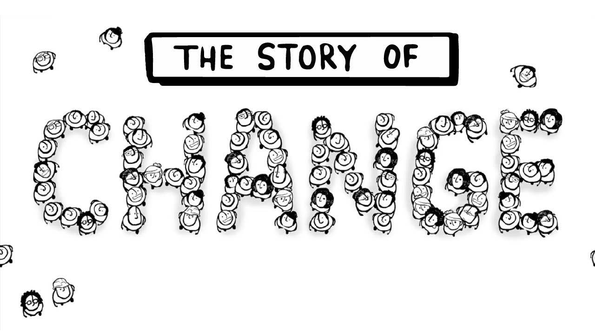
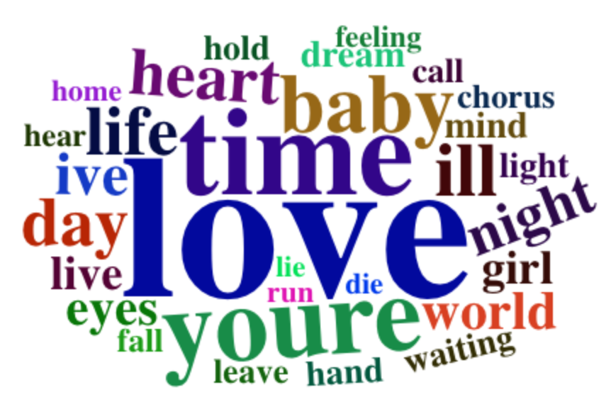
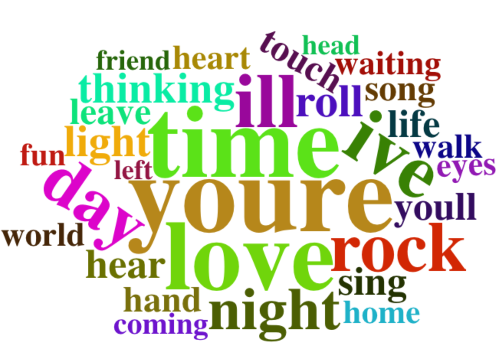
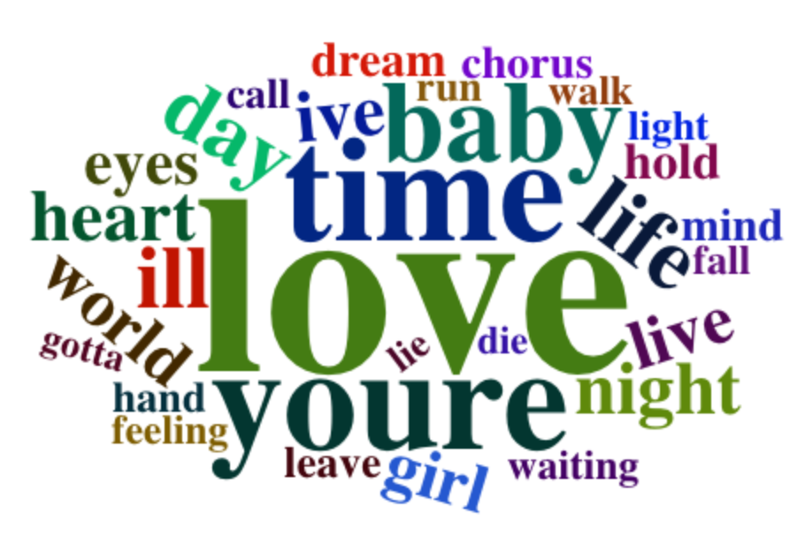
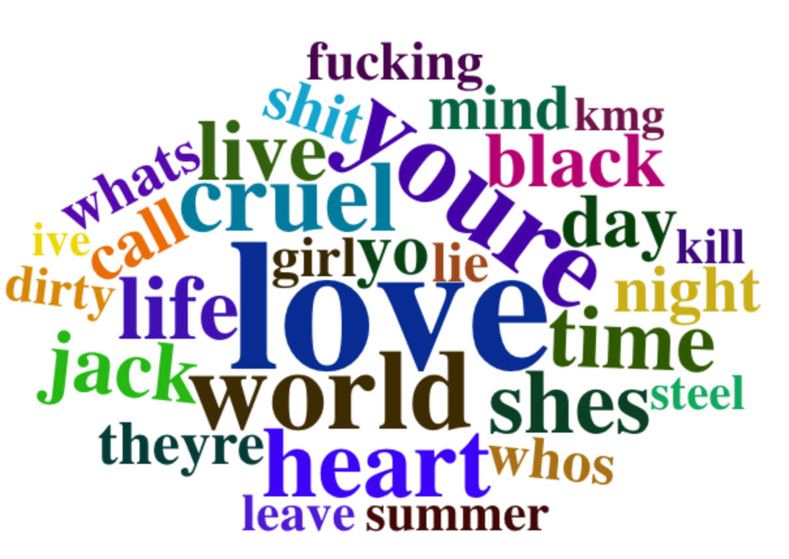
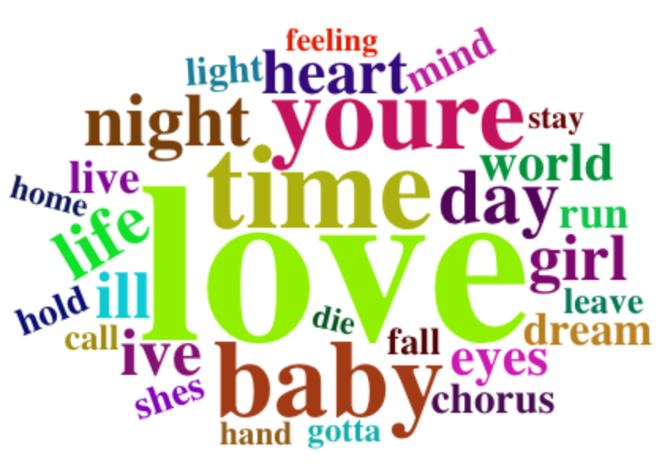

```{r setup, include=FALSE}
knitr::opts_chunk$set(echo = TRUE)
```



## Introduction  

Since  ancient times, songs have been used by human beings to express their emotions. Thier emotions are delivered by the stories in the songs. Each song has its own topic and emotion to deliver. It is natural to imagine that in each age, many songs deliver some common emotions. For exmaple, during the war, most songs are about love and peace. Now, I have more than 120,000 songs' lyrics, so as a student studying data science, I am curious if the change of lyrics can somewhat reflect the change of the people, the society, and the times they live in.

## How did the proportion of genres change and What does that mean? 

```{r load libraries, message=FALSE, warning=FALSE, echo=FALSE}
library(tidyverse)
library(tidytext)
library(plotly)
library(DT)
library(tm)
library(data.table)
library(scales)
library(wordcloud2)
library(gridExtra)
library(ngram)
library(knitr)
```


```{r load data, echo = FALSE, message = FALSE, warning = FALSE}

load('../output/processed_lyrics.RData')
df <- read.csv('../data/artists.csv')
```


Here, for data analysis purpose, I only used years that have more than 200 songs in our dataset without losing representativeness. Also, I will only look into trend for genres that have more than 5% presense of each year to be more credible.


```{r create feature for data, echo=FALSE, message=FALSE}

# group by genre and year
lyric1 <- filter(dt_lyrics, dt_lyrics$genre != "Not Available") %>% 
       group_by(genre,year) %>% 
       summarise(genre_year_count = n())  %>%
       inner_join(dt_lyrics,by = c('genre', 'year')) 

# compute percentage for each genre in each ear
lyric2 <- lyric1 %>%   
       group_by(year) %>% 
       summarise(song_year_total = n())  %>% 
       inner_join(lyric1) %>% 
       mutate(genre_perc = genre_year_count/song_year_total) %>% 
       filter(song_year_total>200 & genre_perc >= 0.05 )


# ggplot(lyric2,aes(x=year,y = genre_perc,col = genre)) +
#   geom_line() +
#   labs(title = 'Proportin of Each Genre Over Time')

```


``` {r fucntion to plot, echo = FALSE,message = FALSE,warning = FALSE}
# Function to Automate Ploting
filter_genre <- function(input){
  lyric2 %>% 
    filter(genre == input) %>% 
    ggplot(aes(x=year,y = genre_perc,col = genre)) + 
    geom_point() +
    stat_smooth()+
    geom_smooth(method = 'lm')
}
```

**Figure 1: Rock and Pop Music Percentage of All Songs**
```{r rock and pop plot, message=FALSE, warning= FALSE,echo=FALSE}

filter_genre(c("Rock",'Pop'))

```


* The most obvious changes happened on 'Pop' and 'Rock' music. Pop music has increased its share from less than 10% to more than 20%, while Rock music's share dramatically decreased from almost 80% to around 40%. This reflects the change of culture that less and less people are interested in Rock music. Meanwhile, pop music gained more attention.


**Figure 2: Country and Jazz Music Percentag of All Songs**
```{r country and jazz plot, message=FALSE, warning= FALSE,echo=FALSE}
genre_list <- unique(lyric2$genre)
filter_genre(genre_list[c(1,7)])

```


* Here, we find the proportion of Country music and Jazz music are steadily decreasing over two decades. This is a sign of people's preference shift.

**Figure 3: Hip-Hop and Metal Music Percentag of All Songs**
```{r hipop and metal plot, echo=FALSE,warning=FALSE,message=FALSE}
filter_genre(genre_list[c(4,5)])
```


* In this plot of Hip-Hop and Metal music proportion, it is hard for us to draw a conclusion because they kind of volitle over time without an obvious trend. The implication here is that Hip-Hop culture and metal music have stable attraction to people. They're not growing the influence.

## How has each genre changed their vocabulary choice?

### Rock Music

```{r prepare for wordcloud ,echo = FALSE}

# prepare for word cloud

lyrics_list <- c("Folk", "R&B", "Electronic", "Jazz", "Indie", "Country", "Rock", "Metal", "Pop", "Hip-Hop", "Other")
time_list <- c("1970s", "1980s", "1990s", "2000s", "2010s")

corpus <- VCorpus(VectorSource(dt_lyrics$stemmedwords))

word_tibble <- tidy(corpus) %>%
  select(text) %>%
  mutate(id = row_number()) %>%
  unnest_tokens(word, text)
```


```{r word cloud function, echo=FALSE}

# words cloud fucntion
wdcld <- function(genre_choice,words_choice,years){
count(filter(word_tibble, id %in% which(filter_year(years)$genre == genre_choice)), word, sort = TRUE) %>%
      slice(1:words_choice) %>%
      wordcloud2(size=0.8, rotateRatio=0.2)
}

```


```{r word choice comparison,echo=FALSE}


filter_year <- function(start){
  if(start != 2010){
    filter(dt_lyrics, year>=start & year<=(start+10))
  }
  else{
    filter(dt_lyrics, year>=start )
  }
}

filter_count <- function(genre_choice,year){
  count(filter(word_tibble, id %in% which(filter_year(year)$genre == genre_choice)), word, sort = TRUE) %>%
      slice(1:20) 
}

```

#### 20 Most Frequent Words Used in Different Decades


```{r rock word comparison, echo=FALSE}
rock70 <- filter_count('Rock',1970)

rock90 <- filter_count('Rock',1990)

rock00 <- filter_count('Rock',2000)

rock10 <- filter_count('Rock',2010)


aa <- cbind(rock70[,1],rock90[,1],rock00[,1],rock10[,1])

colnames(aa) = c('1970s','1990s','2000s','2010')

kable(aa,caption = 'Top word choice for different decades')
```

* **From this table, we can see clearly that although 'love' is the eternel top 1, several words have changed the ranking. For example, the word 'feeling' is very popular in 1970s, but later on, it has never made to top 20 words used in rock music.**

* **Notably, the word 'time' has moved up on the list since 1970s. This may reflect that beside the romance topics like 'love' and 'baby', time has gained more attention from singers. It also might indicate the development of the society in the way that people now have more stuff to do than before, so they need more time and thus treasure time more** \

\

#### Word Cloud Comparison between 1970s & 2010s

**Figure 4: Word Cloud for Rock Music in 1970s**
```{r word cloud 1, echo=FALSE}
wdcld('Rock',30,1970)
```


**Figure 5: Word Cloud for Rock Music in 2010s** \
\

``` {r word cloud2,echo=FALSE,eval = FALSE}

wdcld('Rock',30,2010)

```
* As we can see from the 2 word clouds, the top 5-10 words are repetitive for different times. However, words on the margin are quite different, which represents the change of people's thoughts.


### Pop Music


#### 20 Most Frequent Words Used in Different Decades


```{r pop word comparison, echo=FALSE}
pop7 <- filter_count('Pop',1970)

pop9 <- filter_count('Pop',1990)

pop0 <- filter_count('Pop',2000)

pop1 <- filter_count('Pop',2010)


bb <- cbind(pop7[,1],pop9[,1],pop0[,1],pop1[,1])

colnames(bb) = c('1970s','1990s','2000s','2010')


kable(bb,caption = 'Top word choice for different decades')
```

* **From this table, we found that the word 'dream' was not in top 20 words for pop songs in 1970s and 1990s. However, it appeared in top 20 since the new century began. This phenomenon potentially implies that young people are more prone to dreaming somthing, while in the past, words like 'touch', 'thinking' are used to express emotions. It could be because nowadays young generation are more laid back than the last generation.**

* **Moreover, the word 'live' first appears in the top 20 list in 1990s and it is used even more often in songs created after 2010, this can be the trace that young generation may focus on the current moment more than before when people were more likely to 'thinking'.**

\

#### Word Cloud Comparison between 1970s & 2010s

**Figure 6: Word Cloud for Pop Music in 1970s**


```{r word cloud 3,echo=FALSE,eval=FALSE}

wdcld('Pop',30,1970)
```


**Figure 7: Word Cloud for Pop Music in 2010s** \
\


``` {r word cloud 4,echo=FALSE,eval = FALSE}

wdcld('Pop',30,2010)

```

* As we can see from the 2 word clouds, the top 5-10 words are repetitive for different times. However, words on the margin are quite different, which represents the change of people's thoughts.


### Metal Music


#### 20 Most Frequent Words Used in Different Decades


```{r Metal word comparison, echo=FALSE}
metal9 <- filter_count('Metal',1990)

metal0 <- filter_count('Metal',2000)

metal1 <- filter_count('Metal',2010)


cc <- cbind(metal9[,1],metal0[,1],metal1[,1])

colnames(cc) = c('1990s','2000s','2010')

kable(cc,caption = 'Top word choice for different decades')
```

* **Similarly, Even in Metal music, love, baby, time are top words all the time from 1980s to 2010s. I noticed that the word night has increased its apperance frequency from 1990s to 2010s. This could be an implication of people's nightlife. Maybe now people have more night life than before.**

* **Also, 'dream' appeared in top 20 since 2000s, which is similar to pop music. This might be because singers now like to express their emotions by mentioning dreams. As the communication becomes much easier, dream is a way to reflect the importance of one person to another person.**

* **Noticeably, the word 'light' has become less frequent, which implies that people are now satisfies with their lives and thus decrease the desire of 'light' that represents a better life**

\

#### Word Cloud Comparison between 1980s & 2010s

**Figure 8: Wordcloud for Metal Music in 1980s**


``` {r word cloud 5,echo=FALSE,eval = FALSE}

wdcld('Metal',30,1980)

```

**Figure 9: Wordcloud for Metal Music in 2010s**


``` {r word cloud 6,echo=FALSE,eval = FALSE}

wdcld('Metal',30,2010)

```
* As we can see from the 2 word clouds, the top 5-10 words are repetitive for different times. However, words on the margin are quite different, which represents the change of people's thoughts.

## Conclusion
1. **Through analysis on lyrics, we find that not only have proportions of each genre changed, but also the word choices have changed a lot over time. Although the most common topic of songs are alaways love and time, the following most frequent words can still represent the common emotion and desire of each age.**

2. **This is just an introductory data mining project. In the future, more data analysis tools can be utilized, such as sentiment analysis, n-grams of word choices.**


